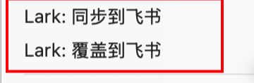

# Feishu Lark CLI Sync

[简体中文](https://github.com/wanghuan9/obsidian-feishu-lark-cli-sync/blob/main/README.md) | [English](https://github.com/wanghuan9/obsidian-feishu-lark-cli-sync/blob/main/README.en.md)

通过本机 `lark-cli` 将 Obsidian Markdown 笔记发布、同步到飞书 / Lark 云文档的桌面端插件。

适合把 Obsidian 作为本地写作源，再把内容同步给团队在飞书 / Lark 中阅读、协作、评论的工作流。

Feishu Lark CLI Sync publishes and synchronizes Obsidian Markdown notes to Feishu / Lark cloud documents through the local `lark-cli`. It is designed for users who write in Obsidian and share the rendered result with their team in Feishu / Lark.

## 功能

- **单篇同步**：将当前 Markdown 笔记创建或同步为飞书 / Lark Docx 文档。
- **目录同步**：右键目录同步全部 Markdown 文件，并在飞书 / Lark 中保留目录层级。
- **按块增量同步**：小改动只更新变动块，不重写整篇文档，可保留飞书 / Lark 的操作历史。
- **全量覆盖同步**：需要完全以本地 Markdown 为准时，可清空并重写远端文档。
- **自动同步策略**：默认使用自动策略；小改动按块增量同步，改动较大、结构复杂或无法安全增量时自动降级为全量覆盖。
- **自动同步触发**：支持保存后同步，也支持 Git `pre-push` hook 在推送代码前同步已绑定文档。
- **内部链接改写**：上传到飞书 / Lark 的内容会把目录内 Markdown 链接、Obsidian Wiki 链接改写成远端文档引用。

## 安装

### Obsidian 社区插件市场（推荐）

插件发布到社区插件市场后，推荐通过 Obsidian 直接安装：

1. 打开 Obsidian → 设置 → 社区插件 → 浏览。
2. 搜索 `Feishu Lark CLI Sync`。
3. 点击安装并启用。

### 手动安装

如果暂时无法通过社区插件市场安装，可以下载源码后使用一键安装脚本：

```bash
git clone https://github.com/wanghuan9/obsidian-feishu-lark-cli-sync.git
cd obsidian-feishu-lark-cli-sync
./install.sh "/path/to/your/vault"
```

把 `/path/to/your/vault` 替换成你的 Obsidian 仓库路径。不传路径时，脚本会提示你输入。

安装完成后，重启 Obsidian，在设置 → 社区插件中启用 `Feishu Lark CLI Sync`。

启用后可以在插件设置页配置 `lark-cli`、默认上传位置、同步策略和 Git hook。

## 使用前准备

先安装并登录 `lark-cli`：

```bash
npm install -g @larksuite/cli
lark-cli version
lark-cli auth login
lark-cli auth status
```

请使用 `lark-cli >= 1.0.53`。旧版本可能导致创建的文档标题显示为 `Untitled`、同步报错等问题。如果版本过低，请升级：

```bash
npm install -g @larksuite/cli@latest
```

如果 Obsidian 找不到 `lark-cli`，在插件设置里的 `lark-cli 路径` 填写绝对路径：

```bash
which lark-cli
```

## 使用

### 单篇同步

打开 Markdown 文件后，可以点击左侧栏图标，或在文件右键菜单中选择：

- `Lark: 同步到飞书`：没有绑定时创建新文档；已有绑定时更新远端文档。
- `Lark: 覆盖到飞书`：强制以本地 Markdown 为准，清空并重写远端文档。



同步方向是单向的：**Obsidian Markdown 是源内容，飞书 / Lark 文档是输出结果**。

默认绑定信息示例：

```yaml
---
lark_doc_url: "https://example.feishu.cn/docx/xxxx"
---
```

### 目录同步

对目录右键，选择 `Lark: 同步目录到飞书`。插件会在飞书 / Lark 中创建对应目录层级，同步目录下的 Markdown 文件，并把目录内链接改写成远端文档引用。

支持的链接形式：

```md
详细设计见 02-database.md。
[组件设计](03-components.md#section)
[[04-api|接口设计]]
```

本地 Markdown 不会因为链接改写而被修改。

### 自动同步

自动同步只处理已绑定文档。首次使用时，需要先在 Obsidian 中执行 `Lark: 同步到飞书` 发布文档，并写入 `lark_doc_url`
绑定链接；后续保存后同步或 Git hook 才能识别并同步该文件。

#### 触发方式

在设置中可选择：

- `关闭`：只手动同步。
- `保存后同步`：Obsidian 运行期间，已绑定 Markdown 文件发生保存事件后自动同步。
- `Git pre-push hook`：执行 `git push` 前同步已绑定 Markdown 文件。

#### 生效场景

`保存后同步` 依赖 Obsidian 捕获文件变更事件，适用于以下场景：

- 在 Obsidian 中直接编辑并保存：可以自动同步。
- 用其他编辑器修改文件，但 Obsidian 同时保持运行并监听该 vault：可以自动同步。
- 用其他编辑器修改文件，且 Obsidian 未运行或未打开该 vault：不会触发自动同步。

`Git pre-push hook` 只依赖 Git 推送命令，不依赖 Obsidian 或其他编辑器是否运行。适合把同步作为提交发布流程的一部分，确保执行
`git push` 前先同步已绑定文档。

使用 Git hook 时，在设置页 `Git Hook` 区域点击 `安装 hook`。如果同步失败，本次 `git push` 会被阻断。

## 设置

- `默认上传位置`：Wiki URL、Wiki 节点 token、文件夹 token；留空则上传到个人文档库。
- `标题来源`：使用第一个 Markdown 标题，或使用文件名。
- `写入 frontmatter 绑定信息`：发布后把飞书文档 URL 写入笔记 frontmatter。
- `同步策略`：默认自动策略；小改动增量同步，改动较大、结构复杂或无法安全增量时自动全量覆盖。
- `同步状态缓存`：控制安全增量同步状态最多保留多少篇文档。

## 增量同步与飞书历史记录

插件会把 Markdown 拆成顶层内容块，并记录这些块与飞书 / Lark 文档 block id 的映射。后续同步时，优先只对发生变化的块执行增量更新，例如替换某个段落、插入新增段落或删除过期段落。

这种按块同步不会清空并重写整篇文档，因此飞书 / Lark 侧能继续保留对应的操作历史、最近更新记录和协作上下文。只有在选择 `全量覆盖`，或自动策略判断本次改动较大、结构复杂、无法安全增量时，才会降级为重写远端文档。


安全增量同步状态保存在：

```text
.obsidian/plugins/feishu-lark-cli-sync/lark-sync-state.json
```

## 说明

- 插件通过本机 `lark-cli` 调用飞书 / Lark，不保存 App Secret、access token 或 OAuth 配置。
- 自动同步只处理已绑定文档，不会自动发布未绑定笔记。
- 如果飞书 / Lark 上有人工修改，请先合并回本地 Markdown；本插件以本地内容为准。

## 开发

```bash
npm install
npm run build
npm test
```

修改源码后，需要重新执行 `npm run build` 生成 `main.js` 和 `lark-sync-core.mjs`。

本地安装到指定 vault：

```bash
./install.sh "/path/to/your/vault"
```

## 许可

MIT License
