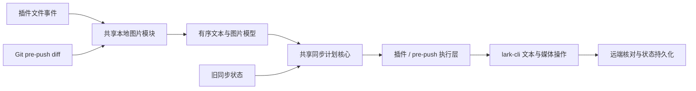

# Feature: Obsidian 本地图片增量同步

**作者**: Codex / wanghuan  
**日期**: 2026-08-16  
**状态**: Implemented

---

## 1. 背景 (Background)
### 1.1 问题描述
- 包含 Obsidian 本地图片的 Markdown 发布到飞书后，图片无法正常展示，导致飞书文档内容不完整，不能直接用于阅读和交付。
- 本地图片文件不参与现有内容签名与变更检测；后续新增、替换或删除图片时，插件无法按块同步对应变化。
- 保存后自动同步只监听 Markdown，用户只修改图片文件时，已绑定的飞书文档不会更新。
### 1.2 现状分析
- 插件的手动发布、手动同步、保存后自动同步和目录发布最终都把 Markdown 字符串交给共享同步核心；当前没有本地图片解析、上传或图片同步状态。
- `src/lark-sync-core.ts` 只把 Markdown 拆成文本类顶层单元，并按文本 hash 生成增量计划；Obsidian Wiki 图片会被当作 paragraph，或被吸收到所在 list 单元。
- `src/main.ts` 创建临时 Markdown 时不会携带附件；本机 `lark-cli` 的 Markdown 导入只支持 HTTP(S) 图片，本地图片必须通过媒体上传能力写入飞书文档。
- 保存后自动同步当前只监听 Markdown 文件；只修改图片文件不会触发引用文档同步。
- 示例文档中的图片位于 Obsidian vault 根目录，不在 Markdown 同目录，必须按 Obsidian 链接解析语义定位附件。
- Git pre-push hook 是独立 Node.js 进程，当前只收集 Markdown 变更。本期需要让它与插件共享图片解析、变更检测、上传和状态维护能力。
### 1.3 主要使用场景
- 用户首次手动发布包含本地图片的 Markdown，飞书文档在原文对应位置展示图片。
- 用户手动同步或保存 Markdown 后自动同步时，只增量处理新增、替换或删除的图片块，未变化图片不重复上传。
- 用户只修改本地图片文件而未修改 Markdown 时，插件自动找到引用该图片的已绑定文档并触发增量同步。
- 用户发布目录时，目录内各 Markdown 的本地图片与文本、内部文档链接一起同步。
- 用户推送 Git 提交时，pre-push 根据 Markdown 或图片变更找到已绑定文档，同步成功后才允许 push。

## 2. 目标 (Goals)
- 让插件手动发布、手动同步、保存后自动同步、目录发布和 Git pre-push 完整处理 Obsidian 本地图片，使飞书文档按原文顺序展示图片。
- 将本地图片纳入按块增量同步：新增、替换和删除只影响对应图片块，未变化图片不重复上传。
- 当图片文件单独发生变化时，自动同步所有引用该图片且已绑定飞书文档的 Markdown。
- 图片缺失、解析失败、上传失败或远端确认失败时明确报错；增量同步可安全重试，全文覆盖按既有同步策略完整重建文本和全部图片。
### 2.1 非目标 (Non-Goals)
- 不支持 vault 外部的绝对路径本地图片。
- 不支持依赖本地 `lark-cli` 的移动端运行环境。
- 不改变 HTTP(S) 网络图片的现有导入方式。

## 3. 需求细化 (Requirements)
### 3.1 功能性需求
- 识别 Obsidian Wiki 图片：`![[a.png]]`、`![[a.png|600]]`、`![[a.png|600x400]]`。
- 识别相对路径 Markdown 图片：``；HTTP(S) 图片继续使用现有 Markdown 导入逻辑。
- 按 Obsidian vault 链接解析语义定位本地图片，支持图片位于 vault 根目录或 Markdown 的其他目录；禁止读取 vault 外部绝对路径。
- 图片出现在列表或段落文字末尾时，将其转换为紧随文字后的独立飞书图片块；图片独立成行时保持对应顺序。
- 首次发布前预检全部本地图片；任一图片不存在或不可读取时，本次发布失败并提示 Markdown 路径、图片引用和解析结果，不创建半成品文档。
- 手动同步、保存后自动同步和目录发布支持本地图片的新增、替换与删除；只操作发生变化的图片块，未变化图片不重复上传。
- Git pre-push 收集 Markdown 和受支持图片的变更；图片文件单独变化时反查所有引用它且已绑定的 Markdown，完成同步后允许 push，解析或上传失败时阻止 push。
- 计算并保存图片二进制内容签名，使图片文件变化能够触发增量同步。
- 监听 vault 内图片文件变化，反查并同步所有引用该图片且已绑定飞书文档的 Markdown；未绑定笔记不自动发布。
- 同一图片被多篇已绑定笔记引用时，同步全部引用文档；同一笔记重复引用同一图片时，在每个引用位置保留独立图片块。
- 将 `|宽度` 和 `|宽度x高度` 映射为飞书图片展示尺寸；未指定尺寸时保持图片原始比例。
- 同步策略保持现状：小改动优先按块增量，复杂变更或无法安全增量时，`auto` 仍可降级为全文覆盖；显式覆盖同步保持可用。
- 全文覆盖含图片文档时，清空并重建全部文本块和图片块，不保留旧图片 block ID；上传中断后允许后续同步恢复完整文档。
### 3.2 非功能性需求
- **兼容性**：兼容现有同步状态和已绑定文档；插件升级后不要求用户重新发布。首次由新版本同步时，应能把远端原有的 Obsidian 图片引用文本转换为真实图片块。
- **一致性**：图片先追加到文末，再按 block ID 移到占位块之后；重新读取远端 XML 确认位置后，删除占位块并刷新同步状态。网络结果不确定时停止并提示。
- **策略兼容**：保持现有 `auto`、安全增量和显式全文覆盖三种策略语义；`auto` 的降级条件不因图片支持而改变，全文覆盖必须重建全部本地图片。
- **性能**：保存后自动同步继续使用现有防抖；同一图片影响多篇文档时对文档去重，沿用不同文档最多 3 并发、同一文档串行的约束。
- **资源范围**：只读取 vault 内被当前 Markdown 引用的图片，不扫描或上传无关文件，不允许通过绝对路径或路径穿越读取 vault 外文件。
- **格式兼容**：支持 PNG、JPEG/JPG、GIF、WebP 和 BMP；格式或大小不被 `lark-cli` 接受时，向用户展示原始失败原因和图片路径。
- **可观测性**：日志包含 Markdown 路径、图片路径、失败阶段和远端文档标识，不记录图片二进制内容。
- **故障恢复**：自动同步失败后允许用户手动重试，不进行后台无限重试；若媒体上传结果不确定，可使用既有全文覆盖能力完整重建文档。
- **pre-push 一致性**：插件与 Git hook 共用图片语义、同步状态和远端核对规则；图片单独变化必须触发引用文档同步，任一目标文档失败时阻止 push。

## 4. 设计方案 (Design)
### 4.1 方案概览
- 采用共享文件系统图片解析方案。插件与 Git pre-push 都向共享本地图片模块提供 `vaultRoot`、Markdown 路径和正文，由该模块统一解析 Obsidian 图片引用、定位 vault 内文件、读取二进制、校验格式与尺寸并计算内容签名。
- 本地图片准备与同步计划保持模块分离：图片模块只交付有序、已验证的图片资源模型；同步计划核心基于文本块、图片块、旧同步状态和同步策略生成统一的增量或全文覆盖计划；宿主执行层负责调用 `lark-cli`、核对远端状态和持久化结果。
- 插件只额外负责监听 Markdown/图片文件事件、维护自动同步触发；pre-push 只额外负责读取 Git diff、反查受影响的已绑定 Markdown 和决定是否阻止 push。两者不实现各自的图片语义。
- 同名图片引用若无法按路径和上下文唯一解析，视为歧义错误，不猜测目标文件；所有资源必须位于 `vaultRoot` 内。
- 增量同步按文档串行执行文本块与图片块操作；每次媒体写入后重新获取远端 revision、block ID 和资源 token，再继续后续步骤并刷新状态。
- 全文覆盖沿用现有同步策略：先完成全部本地图片预检，再重建文本骨架并按原文顺序上传全部图片，最后统一刷新同步状态。上传中断时允许远端暂时处于部分完成状态，后续同步通过远端核对和完整重建恢复。
- 同一远端文档串行，不同文档最多 3 并发；插件与 pre-push 共用图片语义和同步状态。



- 关键取舍：统一文件系统解析会增加自行实现 Obsidian 路径语义的成本，但能保证插件和 pre-push 行为一致；模块化拆分使文件 I/O 不侵入纯同步计划逻辑，便于测试和演进。
### 4.2 组件设计 (Component Design)
#### 4.2.1 核心类/模块设计
- 新增 `src/local-image.ts` 共享模块：扫描 Obsidian Wiki/Markdown 图片引用；基于 `vaultRoot` 解析 vault 内文件；拒绝越界和歧义路径；读取图片二进制、格式、尺寸并计算内容签名；输出按原文排序的图片资源模型。
- `src/local-image.ts` 同时提供按需反向引用扫描。插件在图片事件发生时扫描 vault Markdown；pre-push 在检测到图片变更时扫描 Git 跟踪的 Markdown，不新增持久化索引。
- 新增 `src/media-sync-orchestrator.ts` 共享模块：查找唯一占位块、追加媒体、按 block ID 移动到占位块之后、重新获取远端 revision/XML、确认图片位置并删除占位块。该模块通过宿主能力调用 `lark-cli` 和远端 fetch，不直接拥有插件 UI 或 Git 退出语义。
- 扩展 `src/lark-sync-core.ts`：把本地图片占位符和远端 `` 统一映射为 `img` 单元；占位符包含图片二进制 hash 与引用位置派生的稳定身份，使图片变化参与同步签名，并复用现有新增、替换、删除和覆盖计划。
- `src/main.ts` 保留插件宿主职责：监听 Markdown/图片文件事件、把变化归并为待同步 Markdown 集合、展示通知、控制不同文档并发和状态文件读写；不实现图片语法解析或媒体 Saga 细节。
- `sync-pre-push.mjs` 保留 Git 宿主职责：收集 Markdown/图片变更、通过共享反向索引寻找已绑定 Markdown、调用共享准备/计划/编排能力、在失败时保存成功状态并阻止 push；不实现独立图片语义。
- 构建流程把新增共享模块与同步核心一起打包进 hook 使用的 `lark-sync-core.mjs`，不增加用户侧运行时依赖。
- 不新增大型统一 `SyncService`；沿用稳定的文本同步执行链，只将新增的本地图片准备、反向索引和媒体 Saga 抽为共享模块，以控制改动和回归范围。

依赖方向：

```text
插件事件 / Git diff
        ↓
图片反向索引
        ↓
本地图片准备
        ↓
同步计划核心
        ↓
媒体同步编排
        ↓
插件或 pre-push 提供的 lark-cli / 状态宿主能力
```
#### 4.2.2 接口设计
- 共享模块只暴露领域模型和宿主端口，不依赖 Obsidian `TFile`、插件 UI 或 Git 进程类型。实际接口如下：

```ts
interface PreparedLocalImages {
  content: string;
  images: LocalImageResource[];
}

interface LocalImageResource {
  placeholder: string;
  sourceSyntax: string;
  vaultPath: string;
  absolutePath: string;
  contentHash: string;
  mimeType: string;
  sourceWidth: number;
  sourceHeight: number;
  displayWidth?: number;
  displayHeight?: number;
  alt?: string;
}
```

- `absolutePath` 只在当前执行过程中用于 `media-insert`，禁止写入同步状态；跨运行持久化仅使用规范化 vault 相对路径。
- 本地图片模块提供 `prepareLocalImages(input): Promise<PreparedLocalImages>`，输入为 `vaultRoot`、Markdown vault 路径和正文，一次完成语法扫描、路径解析、资源预检、hash/尺寸读取，并把本地图片语法替换为独立占位块。
- 反向查找提供 `findReferencingMarkdownFiles(input): Promise<string[]>`，输入 Markdown 路径和变化图片路径，只返回 vault 相对路径。
- `buildSyncPlan` 接口不变。同步核心将占位符识别为 `img`，因此继续输出既有 `block_replace`、`block_insert_after`、`block_delete` 或 `overwrite` 操作；执行层在文本操作后物化仍存在的图片占位符。

```ts
interface MediaSyncHost {
  fetchRemoteWithIds(): Promise<RemoteMediaSnapshot>;
  insertImage(image: LocalImageResource): Promise<void>;
  deleteBlock(blockId: string, revisionId?: number): Promise<void>;
}
```

- 插件宿主和 pre-push 宿主分别实现 `MediaSyncHost`，复用各自现有的 `lark-cli` 调用、限流和状态原子写回能力；媒体编排不处理 Notice、系统通知或 Git 退出码。
- 本地图片错误使用可判定原因：`image-missing`、`image-path-ambiguous`、`image-outside-vault`、`image-format-unsupported`、`image-read-failed`。
- 远端媒体失败保留 `lark-cli` 原始错误；上传后图片或占位块位置不符合预期时明确抛出远端核对错误。
- pre-push 通过构建产物中的共享入口调用相同接口，不维护独立接口分支。
#### 4.2.3 数据模型
- 不修改同步状态文件 schema。图片单元继续保存 `stableId/kind/hash/blockId`，其中 `kind=img`、`hash` 为包含图片内容 hash 的占位符 hash；绝对路径和二进制不持久化。
- 插件绑定同时写入 `lark_doc_token` 与 `lark_doc_url`。旧文档只有 wiki URL 时，自举读取真实 doc token 后必须优先复用同 revision 的既有状态，避免 URL/token 别名未命中触发自动全文覆盖。
#### 4.2.4 并发模型
- 单文档内严格串行：文本块操作、媒体插入、远端确认、占位块删除、状态刷新依次执行。不同文档沿用插件与 hook 现有并发限制。
#### 4.2.5 错误处理
- 本地预检失败时不调用远端；媒体或远端确认失败时停止当前文档。pre-push 汇总错误并阻止 push，插件沿用 Notice/日志；显式覆盖可重建完整文档。
### 4.3 核心逻辑实现
- 图片引用先替换为 `FEISHU_LARK_LOCAL_IMAGE_<sha256>` 占位内容。同步核心将它与远端 `` 按顺序映射为图片单元；新增或变化图片先把目标块变为占位内容，再通过无选择器的 `docs +media-insert` 追加图片，并用 `block_move_after` 移到占位块之后，写后确认并删除占位内容。禁止使用 `--selection-with-ellipsis`，避免飞书重建无关正文 block 并污染历史记录。
- 图片文件事件通过反向扫描找到引用笔记。pre-push 对图片 diff 执行相同扫描，因此 Markdown 未变化也会进入同步任务。
### 4.4 方案优劣分析
- 优点：插件和 hook 共用语义；不改状态 schema；文本同步路径保持稳定；图片 hash 可驱动精确替换。
- 局限：反向引用当前按需扫描全部 Markdown；媒体上传成功但客户端未收到结果时无法证明幂等，需重试或覆盖恢复；远端图片本身不暴露本地 hash，状态丢失后会保守刷新本地图片。

## 5. 备选方案 (Alternatives Considered)
- 直接把本地路径交给 Markdown 导入：hook 临时目录和 `lark-cli` 导入能力无法保证读取 Obsidian 附件，放弃。
- 插件和 hook 分别实现图片逻辑：容易出现路径、hash 和错误语义分叉，放弃。
- 为图片另建持久化状态 schema：能力可更强，但迁移和兼容成本高；当前用占位符 hash 复用现有单元状态即可满足需求。

## 7. 测试计划 (Test Plan)
### 7.1 单元测试
- Wiki/Markdown/HTTP/代码围栏语法、尺寸解析、根目录与相对路径、越界与同名歧义、反向引用、连续图片物化、状态失效刷新。
### 7.2 集成测试
- pre-push 仅修改图片二进制时，验证反查绑定文档、精确替换、媒体上传、占位清理和状态刷新。
- 全量执行现有同步核心、插件接线和 pre-push 回归测试。
### 7.3 性能测试（如适用）
- 本期不单独增加性能基准；反向扫描只在图片事件或图片 diff 时执行。

## 8. 可观测性 & 运维 (Observability & Operations)

- 不新增配置、指标或运维接口。错误沿用插件日志/Notice 和 pre-push stderr；升级不需要状态迁移。
- 回滚可恢复旧插件构建与 hook 文件；旧版本会忽略新增图片能力，但状态文件仍兼容。

## 9. Changelog
| 日期 | 变更内容 | 作者 |
|------|----------|------|
| 2026-08-16 | 完成本地图片解析、增量同步、自动同步与 pre-push 支持 | Codex / wanghuan |
